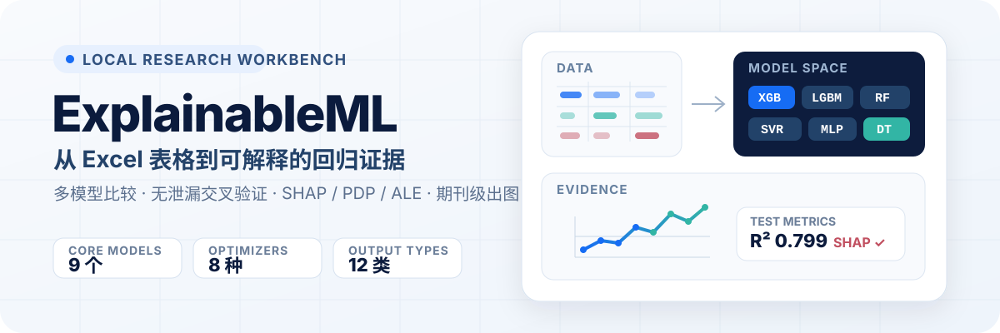
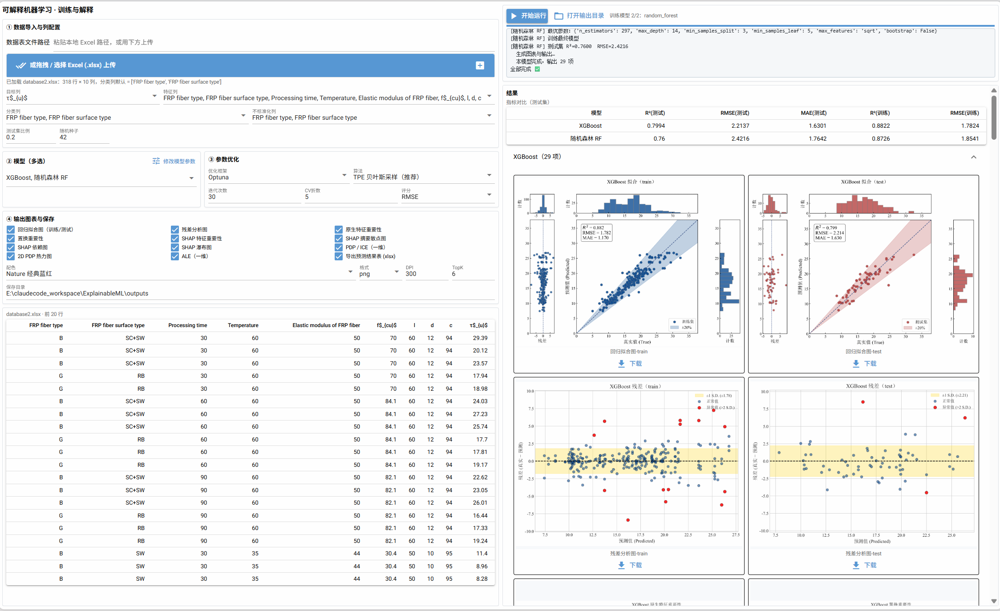
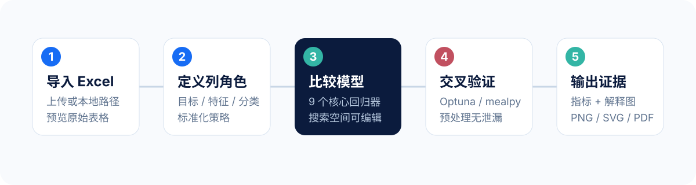
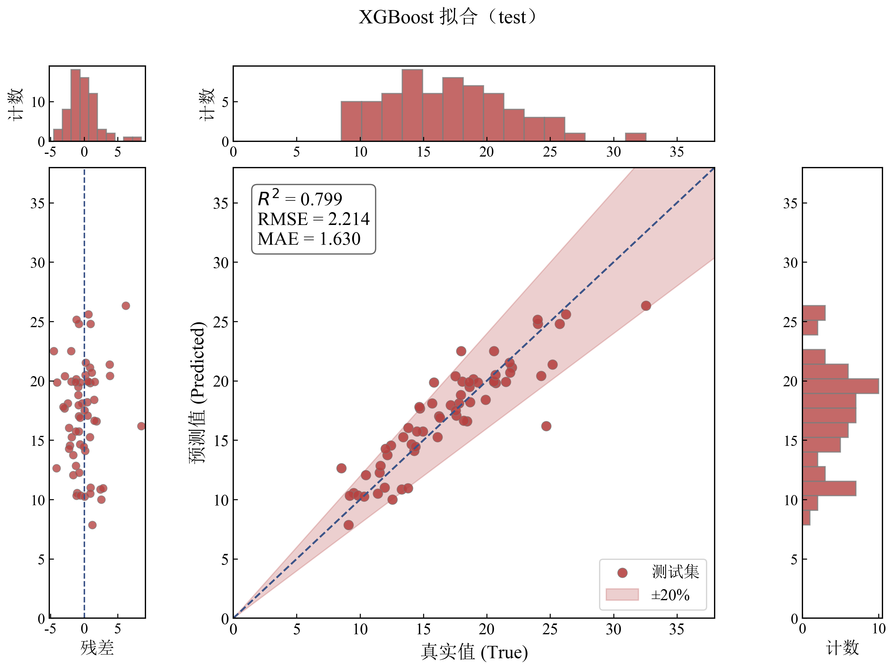
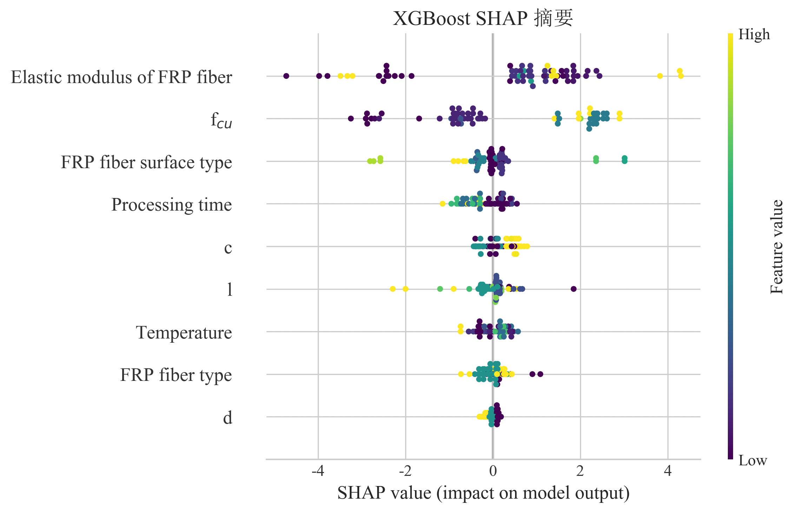
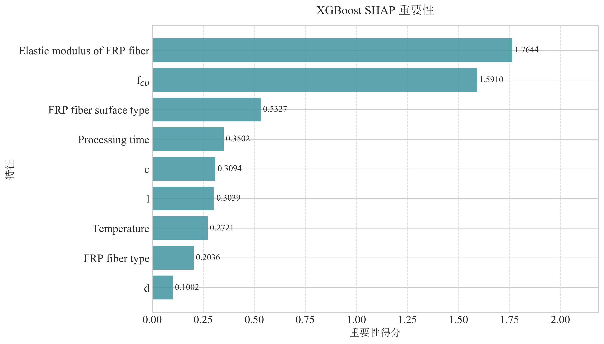
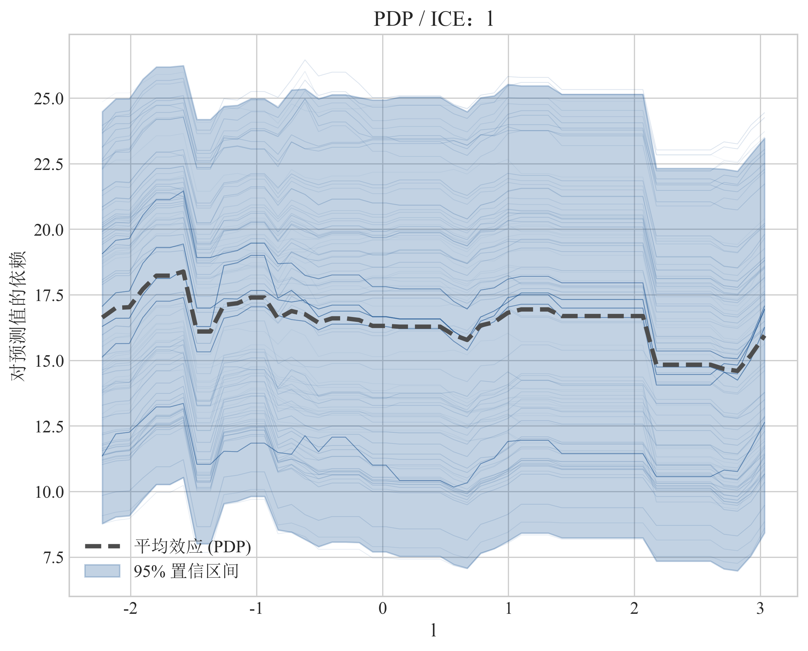
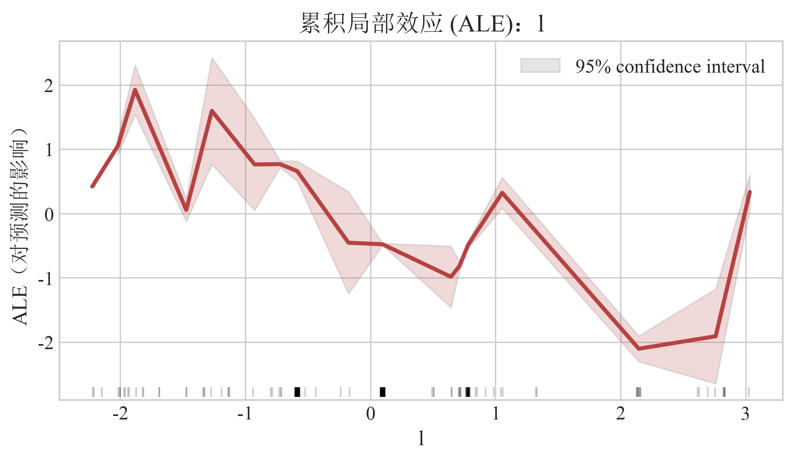

<p align="center">
  
</p>

<p align="center">
  面向工程、材料与实验数据研究的本地回归分析软件。<br>
  用一条可复现工作流完成数据配置、多模型比较、参数优化、指标评估与可解释性出图。
</p>

<p align="center">
  <code>本地运行</code> · <code>Excel 工作流</code> · <code>多模型比较</code> ·
  <code>无泄漏 CV</code> · <code>SHAP / PDP / ALE</code> · <code>期刊级出图</code>
</p>

<p align="center">
  
</p>

> ExplainableML 只在本机处理数据。界面由 NiceGUI 提供运行时，启动后自动打开本地地址 `http://localhost:8080`；它不是需要部署的在线网站。

## 为什么使用 ExplainableML

- **把重复脚本变成统一管道**：从 Excel 导入到最终图表，模型共享同一套数据、验证、评估与输出逻辑。
- **让比较结果更可信**：预处理器位于 sklearn Pipeline 内部，每个交叉验证折独立拟合，避免编码与标准化造成数据泄漏。
- **让解释结果可以直接交付**：一次运行可生成指标表、预测表及 12 类解释图，并统一控制配色、格式、DPI 与 Top-K。

## 从数据到证据

<p align="center">
  
</p>

首次成功运行只需要五步：导入 `.xlsx`，指定目标列与特征列，选择模型和优化算法，勾选输出，开始训练。

## 核心能力

| 模块 | 当前能力 |
| --- | --- |
| 数据 | 上传 Excel 或填写本地路径；配置目标列、特征列、分类列、不标准化列；预览表格并自动检测分类列 |
| 模型 | 9 个核心回归器：XGBoost、LightGBM、CatBoost、RF、GBR、DT、KNN、SVR、MLP；可选 TabPFN GPU |
| 优化 | Optuna：TPE、随机、CMA-ES；mealpy：PSO、GWO、HHO、ARO、INFO；每个模型的搜索空间可在本次运行中修改 |
| 验证 | K 折交叉验证；RMSE、MAE、R²；固定随机种子；预处理严格封装在验证管道内 |
| 解释 | 回归拟合、残差、原生/置换/SHAP 重要性、SHAP 摘要/依赖/瀑布、PDP·ICE、2D PDP、ALE |
| 导出 | 预测结果 `.xlsx`；图片支持 PNG / SVG / PDF、自定义 DPI、Top-K 与 5 组期刊配色 |

> `GridSearchCV`、`RandomizedSearchCV` 与手动默认参数路径仍保留在核心 API 中；当前图形界面聚焦 Optuna 与 mealpy。

## 真实输出

下面的图表由本项目工作流直接生成，不是概念示意图。

<p align="center">
  
</p>
<p align="center"><sub>回归拟合：真实值、预测值、残差分布与测试指标集中呈现。</sub></p>

<p align="center">
  
</p>
<p align="center"><sub>SHAP 摘要：同时观察特征重要程度、影响方向与样本分布。</sub></p>

<details>
<summary><strong>查看更多真实输出：SHAP 重要性、PDP·ICE 与 ALE</strong></summary>

<br>

<p align="center">
  
</p>

<p align="center">
  
</p>

<p align="center">
  
</p>

</details>

## 快速开始

### 1. 准备环境

- [uv](https://docs.astral.sh/uv/)
- Python `>=3.10,<3.13`；项目会在根目录创建并使用 `.venv`

### 2. Windows

最简单的方式是双击根目录的 `start.bat`。首次运行会自动执行依赖同步。

也可以在 PowerShell 中手动启动：

```powershell
uv sync
.\.venv\Scripts\python.exe -m app.main
```

### 3. 其他平台

仓库保留 `start.sh` 启动器，用于 macOS、Linux 与 Git Bash 环境。

浏览器会自动打开 `http://localhost:8080`。如果没有自动打开，手动访问该地址即可。

> Windows 上若 uv 默认缓存出现 `too many temporary files` 或 `os error 183`，可将缓存放到项目同盘目录：
>
> ```powershell
> $env:UV_CACHE_DIR = 'E:\uv-cache'
> uv sync
> ```

## 使用流程

1. **数据导入**：上传 Excel 或输入本地路径，检查表格预览。
2. **列配置**：指定目标、特征、分类与不标准化列，并设置测试集比例和随机种子。
3. **模型与优化**：多选模型，必要时修改搜索空间；选择优化框架、算法、预算、CV 折数和评分。
4. **输出设置**：勾选图表，设置输出目录、图片格式、DPI、Top-K 与配色。
5. **运行与检查**：查看实时日志、指标对比表和图像画廊，下载单张结果或打开输出目录。

## 项目结构

```text
app/
├── main.py           # NiceGUI 软件入口与页面编排
├── core/
│   ├── data.py       # Excel、列配置、预处理与数据划分
│   ├── models.py     # 模型注册表、默认参数与搜索空间
│   ├── space.py      # 声明式空间 → Optuna / Grid / mealpy
│   ├── optimize.py   # 交叉验证与优化器适配
│   ├── pipeline.py   # 训练、预测与评估主流程
│   ├── explain.py    # 12 类输出的生成编排
│   ├── plots.py      # 回归与解释图表
│   ├── metrics.py    # MSE / RMSE / MAE / R²
│   └── themes.py     # 期刊级配色方案
├── ui/state.py       # 后台任务与界面状态
└── assets/           # 本地字体资源

tests/smoke_core.py   # 训练 → 评估 → 出图冒烟测试
start.bat             # Windows 启动器
start.sh              # macOS / Linux / Git Bash 启动器
```

项目源自 `Multi_algorithm_comparison_basic_version/` 的工程化重构：将多算法研究中 15 个高度重复的脚本收敛为统一管道、模型注册表、优化器适配层与输出分派层。当前任务范围为**表格回归**，列语义完全由用户在界面中指定。

## 开发与验证

使用自己的 Excel 数据运行核心冒烟测试：

```powershell
.\.venv\Scripts\python.exe tests\smoke_core.py .\data\your_dataset.xlsx
```

测试会跑通随机森林优化、KNN 训练、指标对比和多类图表输出，并检查结果文件是否存在。

实现约束：

- 树模型使用 `TreeExplainer`；KNN、SVR、MLP 等非树模型使用经过背景与样本下采样的 `KernelExplainer`。
- 绘图使用 Matplotlib `Agg` 后端，适合后台任务与批量保存。
- 单项解释图生成失败不会中断其他输出；警告会写入运行日志。

<details>
<summary><strong>可选：启用 TabPFN GPU</strong></summary>

TabPFN 不属于默认环境。Windows 下运行 `setup_gpu_env.bat`；其他平台可使用仓库中的 `setup_gpu_env.sh`。

当前脚本按参考环境安装 `torch 1.12.1+cu113`、TabPFN 与 `tabpfn-extensions`。扩展包声明的 torch 版本与该参考环境存在冲突，因此脚本使用 `--no-deps` 安装；完成后不要再次单独执行 `uv sync`，否则手动安装的 GPU 依赖可能被移除。TabPFN 推理较慢，建议先关闭 SHAP 与 PDP 输出验证基础预测。

</details>

<details>
<summary><strong>扩展：新增 mealpy 优化器</strong></summary>

mealpy 适配集中在 [`app/core/optimize.py`](./app/core/optimize.py)：

1. 在 `METHODS_BY_FAMILY["mealpy"]` 注册 `mealpy_<name>` 界面选项。
2. 在 `_MEALPY_ALGORITHM_NAMES` 增加日志显示名。
3. 在 `_build_mealpy_optimizer()` 返回对应的 mealpy 实例。

模型搜索空间不需要重复定义；[`app/core/space.py`](./app/core/space.py) 会将同一份声明式空间转换为 mealpy 边界。运行时若 mealpy 异常，系统会记录警告并回退到 Optuna TPE，因此扩展后应同时检查日志与最优参数来源。

</details>

## 引用

如果 ExplainableML 对你的研究有帮助，请引用：

> Wu, J., & Chen, L. (2026). Prediction of bond strength between FRP bars and UHPC using explainable machine learning algorithms. *Journal of Building Engineering*, **119**, 115174. <https://doi.org/10.1016/j.jobe.2025.115174>

```bibtex
@article{Wu2026FRPUHPC,
  author  = {Wu, Jishu and Chen, Li},
  title   = {Prediction of bond strength between FRP bars and UHPC using explainable machine learning algorithms},
  journal = {Journal of Building Engineering},
  year    = {2026},
  volume  = {119},
  pages   = {115174},
  doi     = {10.1016/j.jobe.2025.115174}
}
```

## License

[MIT](./LICENSE) © 2026 吴纪曙
